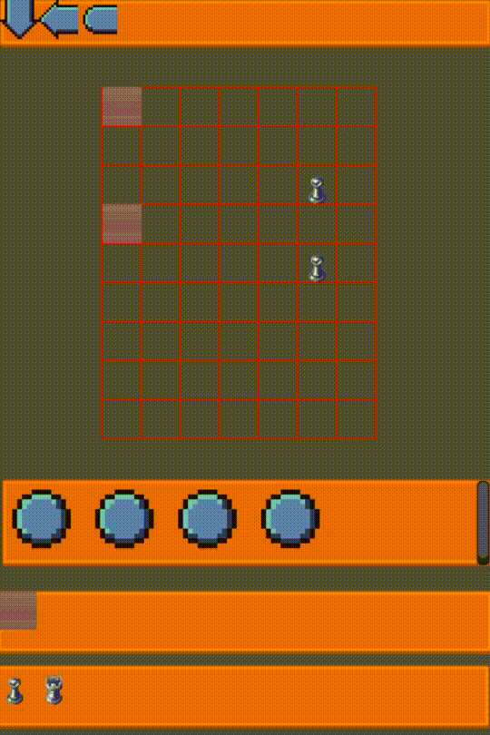
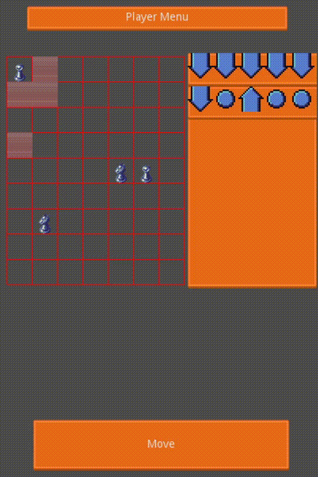
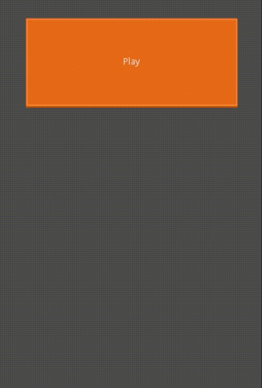
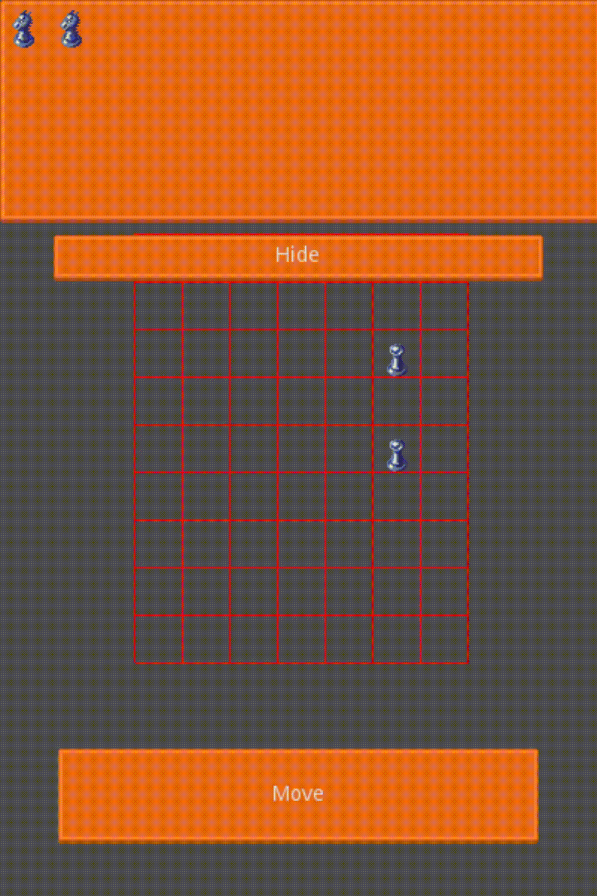
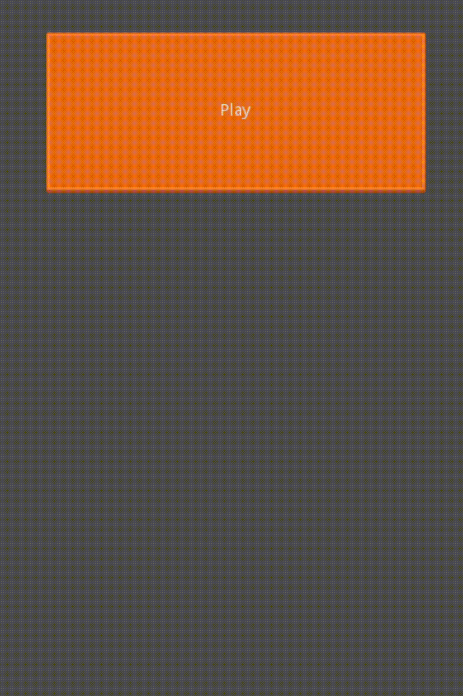

# Blog for Pocket Battles

Godot game I'm building within the \#FFSjam on itch.io.

> Graphics are placeholders

## The Game

It will be a tun based puzzle strategy game.

### 15/01 Editor almost done

Draw drawing and opponent placing and on is now implemented.

### 13/01 Added Level editor and Implemented the battle system

Added a level editor for the game, especially to be able to test edge-case level scenarios.

Entities will now fight at the end of the turn, if they end up in the same position.

### 11/01 Added Tiles and their functionality

The wall tile was implemented so far an blocks moves entering.

### 09/01 Finished the in game ui

Added all in game ui elements, and connected them to the entities.

### 07/01 More ui stuff and move selection

Implemented move selection

Select and place player nodes.

### 05/01 Base scene mechanic

Added the simple grid and implemented a level loader.
Implemented using independent objects for flexability.

And base ui for player entity placement.

### TODO

- [ ] build levels
- [ ] implement main game mecanic
- [ ] anchor ui element to support different resolutions
- [x] Level loaded and saver using JSON 
- [x] level init enemy spawing and player selection
