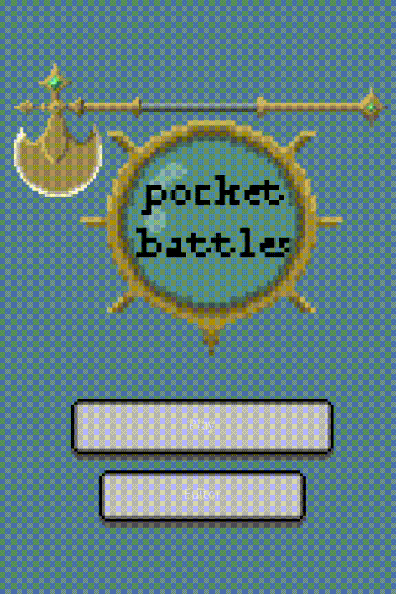
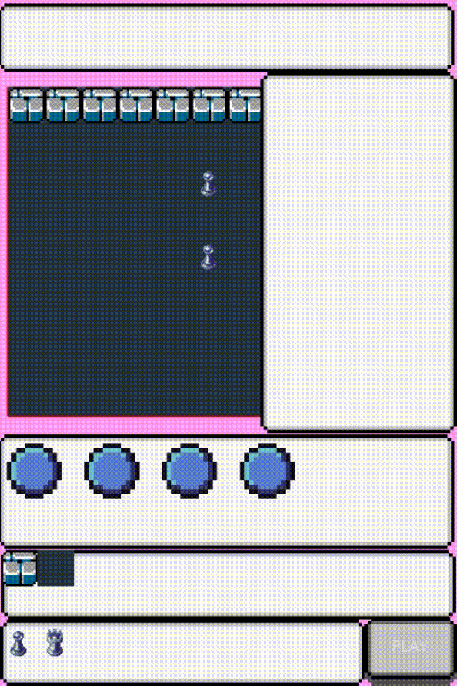
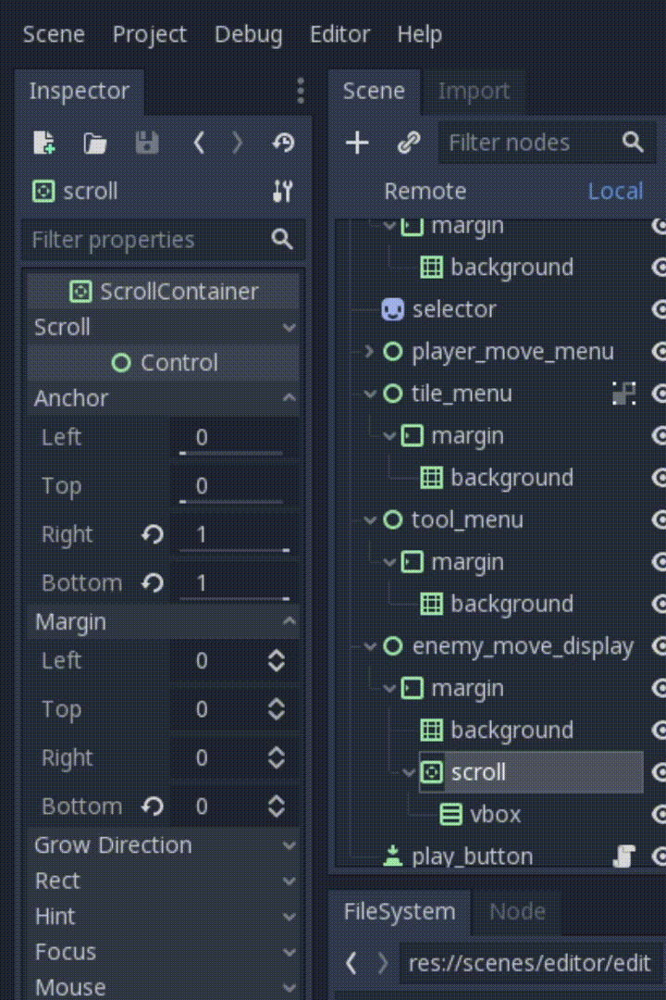
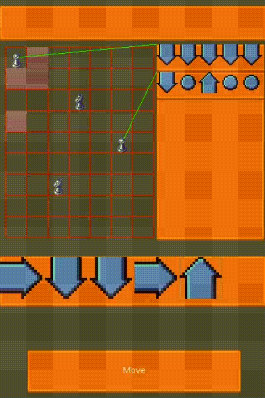

# Blog for Pocket Battles

A hard memory puzzle, battle rpg strategy game ;) 

### Asset Sources and Mentions:

- [Base ui](https://opengameart.org/content/pixel-uihud-pack)
- [Base Tile Assets](https://opengameart.org/content/bomber-planet-16x16-pixel-art-assets)
- [Pixel Webpons By SCay](https://opengameart.org/content/pixel-weapons-1)

Godot game I'm building within the \#FFSjam on itch.io.

> Some graphics are placeholders

### Jam Reflection

This was my first GoDot game and therefore also the first time I used GD Script. I have learned a lot about Godot Engine and can as I thought - develop games a lot faster - using a engine. GD Script was fast to lean since so pythonic, though offers some typing constructs, So that I missed Kotlin, which I used with Libgdx., not as much as I expected. And the workings of the Engine are quite comprehensible for Linux user since the atomic and tree node structure. Discomfort what was I seeked in my tooling so I'd learn a wider variety of code and design methods. I chose vim as editor, in combination with tmux terminal multiplexing. This went very well with the command-line compatibility of Godot. Code could be run executed and exported via terminal, that also handled the file management, visual editor was only used to edit scenes animations and specific exported node properties. For the game - since I wanted to learn more about dynamic ui in combination with editor supported animations, but also dynamic level  building - i chose a combination of puzzle strategy and character rpg. Which might not be that much of a playable game anyhow but made me learn what I wanted to learn.

I wanted to learn godot for a longtime and using the Jam as a motivator worked quite well, so even though now apparently not submitted, I'm happy with the game and more so with what I learned.

Next Jam I'll be using GoDot, till then play the one prototype level of the debug Android or Web Version:

-- yo future me: place the link here --

## The Development Process

### 01/02 Working Game Prototype No polishing, And I did not  miss the deadline or did I?

It said submissions open until 12:00 today and that the submissions are closed already which sort of makes no sense, but since I only used the Jam as a excuse to learn GoDot Engine that does not really matter.

### 25/01 Desighned temporary logo, ui polishing

Used some open source pixel art to desighn a fast logo, as the FFSjam Deadline is coming up.

### 21/01 Adding new Graphics & found a  bug in godot?

Here the new Look (see sources on top of page)

Godot Scroll boxes seem to change anchors as thy want. Worked around that by resizing the object by code rather than relying on godots anchoring system.

### 16/01 adding animations and battle system infrastructure

The entities can move now and fights are performed in order of entity placement. And all entities have individual animations now.

Before I change the graphics i can improved the look by adding some animations.

### 15/01 Editor almost done

Draw drawing and opponent placing and on is now implemented.

### 13/01 Added Level editor and Implemented the battle system

Added a level editor for the game, especially to be able to test edge-case level scenarios.

Entities will now fight at the end of the turn, if they end up in the same position.

### 11/01 Added Tiles and their functionality

The wall tile was implemented so far an blocks moves entering.

### 09/01 Finished the in game ui

Added all in game ui elements, and connected them to the entities.

### 07/01 More ui stuff and move selection

Implemented move selection

Select and place player nodes.

### 05/01 Base scene mechanic

Added the simple grid and implemented a level loader.
Implemented using independent objects for flexability.

And base ui for player entity placement.

### TODO

To produce a semi finished game till 31 folling has to be done:

- [] Add new character sprites
- [] Add facing direction filter (also for moves)
- [] Add a actual victory screen
- [] Make at least 10 levels
- [] Add Level Select Menu
- [] Add level save option
- [] Add one special entity: Archer

Smaller fixes:

- Remove character button hover
- Bug: Editor character moves sometimes maps to wrong entity
